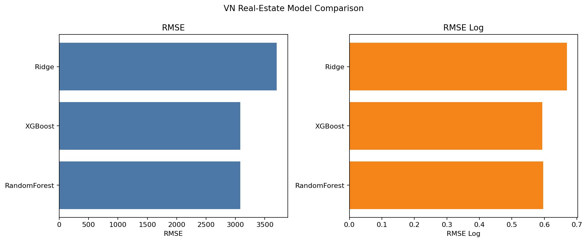
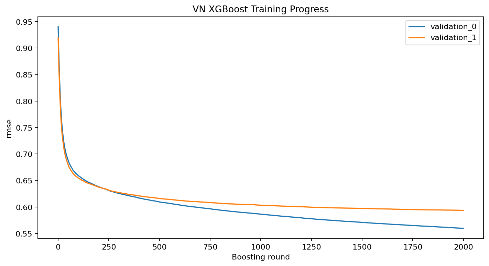
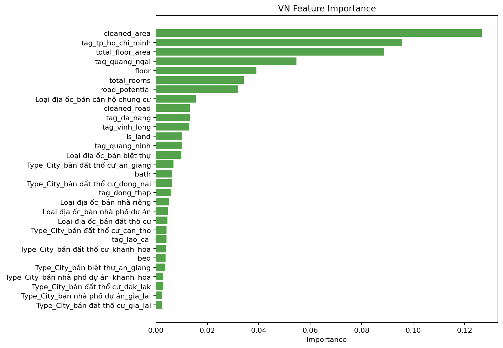
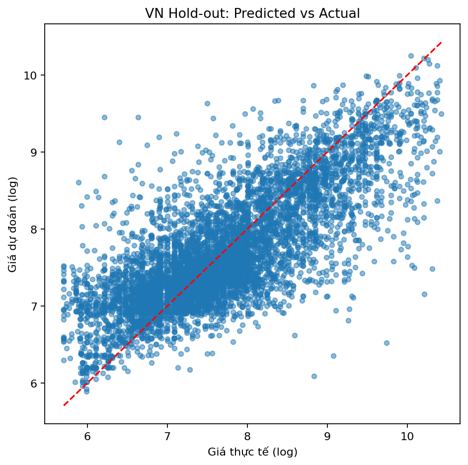
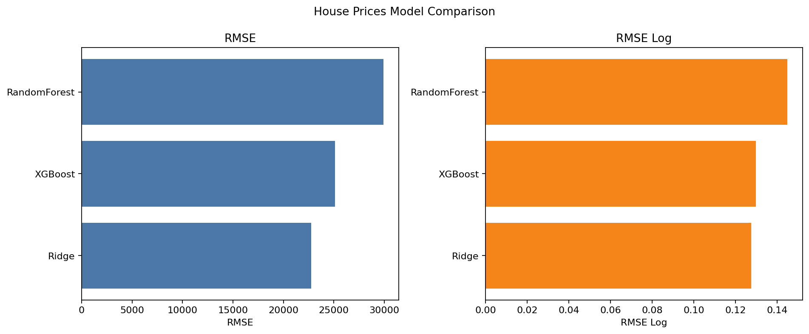
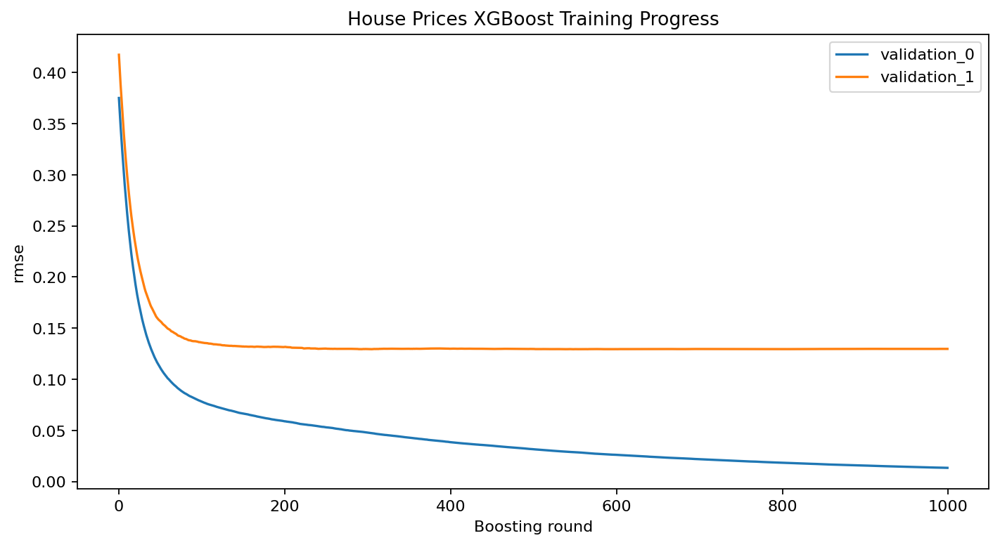

This folder is the refactored version of the original notebook project.

## Structure

```text
Final_version/
├── data/               # Sample data, lightweight exports only
├── notebooks/          # Tutorial notebooks / documentation space
├── src/                # Main source code
│   ├── __init__.py
│   ├── preprocess.py   # Data cleaning and feature engineering
│   ├── model.py        # Models, metrics, and evaluation helpers
│   └── train.py        # Training pipelines for each dataset
├── requirements.txt    # Python dependencies
├── main.py             # Main entry point
└── README.md           # Project overview
```

## What changed

- Notebook logic has been moved into reusable Python modules under `src/`.
- `main.py` is the entry point for running a dataset pipeline.
- `requirements.txt` lists the runtime dependencies.
- The original notebooks are kept as tutorial material under `notebooks/`.
- `.gitignore` excludes large outputs, caches, and generated artifacts.

## How to run

### Vietnam real-estate pipeline

```bash
python main.py --dataset vn
```

### House Prices pipeline

```bash
python main.py --dataset house
```

### Generate report charts

```bash
python main.py --report
```

## Output

- The VN pipeline exports the cleaned dataset to `data/VN_BĐS_data/property_final_clean.csv`.
- The House Prices pipeline exports `submission.csv`.
- The report command creates summary charts under `result/report/`.

## Results Gallery

The figures below are generated automatically after running the pipelines and are stored under `result/`.

### Vietnam Real-Estate

#### Model Comparison



#### XGBoost Training Curve



#### Feature Importance



#### Hold-out Prediction vs Actual



### House Prices

#### Model Comparison



#### XGBoost Training Curve



#### Submission Distribution

If you generate the report with `python main.py --report`, GitHub will also show summary charts under `result/report/`.
